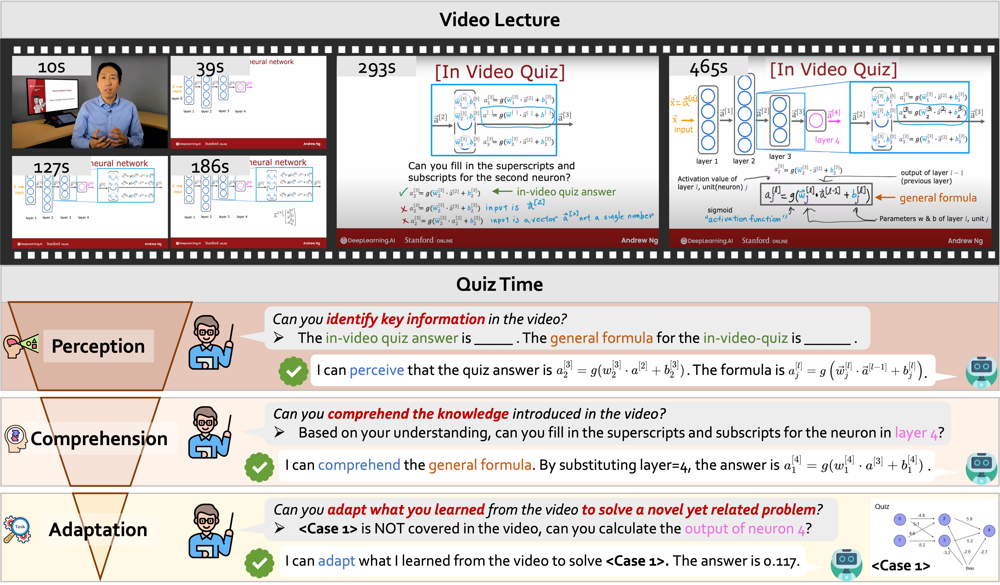

# LMMs-Lab: Building Multimodal Intelligence

We are a group of researchers, with a focus on large multimodal models (LMMs). We wish to bring insights to community with our research. 

## [LLaVA-OneVision 1.5](https://github.com/EvolvingLMMs-Lab/LLaVA-OneVision-1.5/tree/main)

    

  <picture>
    <source media="(prefers-color-scheme: dark)" srcset="https://github.com/EvolvingLMMs-Lab/LLaVA-OneVision-1.5/blob/main/asset/llava_onevision_black.png">
    <source media="(prefers-color-scheme: light)" srcset="https://github.com/EvolvingLMMs-Lab/LLaVA-OneVision-1.5/blob/main/asset/llava_onevision_white.png">
    
  </picture>

🤗 **[Models and Datasets](https://huggingface.co/collections/lmms-lab/llava-onevision-15-68d385fe73b50bd22de23713)** |
🖥️ **[Demo](https://huggingface.co/spaces/lmms-lab/LLaVA-OneVision-1.5)** |
📄 **[Tech Report](https://github.com/anxiangsir/asset/blob/main/paper/LLaVA_OneVision_1_5.pdf)**

## Introduction
**LLaVA-OneVision-1.5** introduces a family of fully open-source large multimodal models (LMMs) that operate on **native-resolution images**, achieve **state-of-the-art** performance, and require comparatively **lower training costs**.

#### **Superior Performance**
  - The model leads on multiple multimodal benchmarks and generally surpasses Qwen2.5-VL.
  - Training on native-resolution images significantly improves its visual understanding.

#### **High-Quality Data at Scale**
  - The pretraining corpus comprises large-scale, concept-balanced, diverse, and high-quality captions curated with strict filtering and quality control.
  - The instruction-tuning dataset is comprehensive and covers a wide range of tasks.

#### **Ultra-Efficient Training Framework**
  - The end-to-end training cost is about $16,000 on A100 GPUs at roughly $0.60 per GPU-hour.
  - The system is built on Megatron-LM with support for MoE, FP8, and long-sequence parallelism, and the codebase is optimized for cost-effective scaling.

#### **Fully Open Framework**
  - The project releases high-quality pretraining and SFT datasets along with the complete training framework, configurations, and recipes.
  - It also provides detailed training logs and metrics to enable reproducibility and community adoption.

## [EgoLife](https://github.com/EvolvingLMMs-Lab/EgoLife)

    

For one week, six individuals lived together, capturing every moment through AI glasses, and creating the EgoLife dataset. Based on this, we build models and benchmarks to drive the future of AI life assistants that are capable of recalling past events, tracking habits, and providing personalized, long-context assistance to enhance daily life. This multi-personal, multi-view, multimodal, long-term setting is just the beginning—unlocking new frontiers for AI assistants with true deeper understanding. 🚀

## [OpenR1-Multimodal](https://github.com/EvolvingLMMs-Lab/open-r1-multimodal)

    

We conducted a speed-run on to investigate R1's paradigm in multimodal models after observing growing interest in R1 and studying the elegant implementation of the GRPO algorithm in `open-r1` and `trl`.

## [LMMS-Eval](https://github.com/EvolvingLMMs-Lab/lmms-eval)

    

We're on an exciting journey toward creating Artificial General Intelligence (AGI), much like the enthusiasm of the 1960s moon landing. This journey is powered by advanced large language models (LLMs) and large multimodal models (LMMs), which are complex systems capable of understanding, learning, and performing a wide variety of human tasks.

To gauge how advanced these models are, we use a variety of evaluation benchmarks. These benchmarks are tools that help us understand the capabilities of these models, showing us how close we are to achieving AGI. To address this challenge, we introduce lmms-eval, an evaluation framework meticulously crafted for consistent and efficient evaluation of LMM.

## [VideoMMMU](https://github.com/EvolvingLMMs-Lab/VideoMMMU)

    

VideoMMMU is a multi-modal, multi-disciplinary video benchmark that evaluates the knowledge acquisition capability from educational videos.

Our dataset comprises 300 lecture-style videos spanning 6 professional disciplines: Art, Business, Science, Medicine, Humanities, and Engineering, with 30 subjects distributed among them.

VideoMMMU features a Knowledge Acquisition-based Question Design. Each video includes 3 question-answer pairs aligned with the three knowledge acquisition stages: Perception (identifying key information related to the knowledge), Comprehension (understanding the underlying concepts), and Adaptation (applying knowledge to new scenarios).

VideoMMMU proposes a knowledge acquisition metric (<i>&Delta;knowledge</i>) to measure performance gains on practice exam questions after learning from videos. This metric enables us to quantitatively evaluate how effectively LMMs can assimilate and utilize the information presented in the videos to solve real-world, novel problems.

## [LLaVA-NeXT](https://llava-vl.github.io/blog/2024-05-10-llava-next-stronger-llms/)

    

We expanded the LLaVA-NeXT series with recent stronger open LLMs, reporting our findings on more capable language models:
We maintain an efficient training strategy like previous LLaVA models. We supervised finetuned our model on the same data as in previous LLaVA-NeXT 7B/13B/34B models. Our current largest model LLaVA-NeXT-110B is trained on 128 H800-80G for 18 hours.

With stronger LLMs support, LLaVA-NeXT achieves consistently better performance compared with prior open-source LMMs by simply increasing the LLM capability. It catches up to GPT4-V on selected benchmarks.

We report detailed ablations, including architectural modifications, enlarged visual tokens, and varied training strategies, to explore potential improvements in LLaVA-NeXT's performance.

## [LLaVA-NeXT-Video](https://llava-vl.github.io/blog/2024-04-30-llava-next-video/)

    

We explore LLaVA-NeXT's capabilities in video understanding tasks, highlighting its strong performance. Key improvements include:

**SoTA Performance!** Without seeing any video data, LLaVA-Next demonstrates strong zero-shot modality transfer ability, outperforming all the existing open-source LMMs (e.g., LLaMA-VID) that have been specifically trained for videos. Compared with proprietary ones, it achieves comparable performance with Gemini Pro on NextQA and ActivityNet-QA.

**Strong length generalization ability** Despite being trained under the sequence length constraint of a 4096-token limit, LLaVA-Next demonstrates remarkable ability to generalize to longer sequences. This capability ensures robust performance even when processing long-frame content that exceeds the original token length limitation.

**DPO pushes performance** DPO with AI feedback on videos yields significant performance gains.

